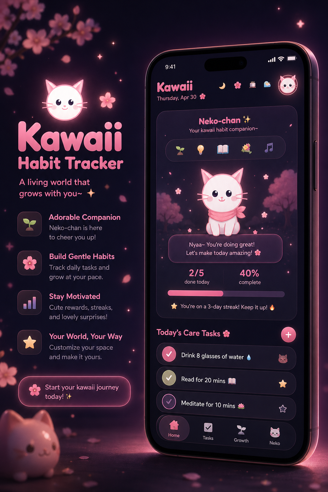

<div align="center">

# Kawaii Habit Tracker

### *A living world that grows with you~*

[](https://kawaii-habit-tracker.vercel.app)
[](https://react.dev)
[](https://vite.dev)
[](https://kawaii-habit-tracker.vercel.app)
[](https://github.com/TheAlgo7/kawaii-habit-tracker)

</div>

<p align="center">
  
</p>

Kawaii Habit Tracker treats habits as a relationship, not a checklist. The app builds attachment: habits feed trust, trust shapes Neko's mood, and progress turns into a world that feels alive enough to revisit. Instead of sterile task management, you get a companion who remembers, reacts, and evolves with your consistency. Show up, and your world brightens. Drift away, and Neko feels it too.

> **Status:** Actively in development. Core habit tracking and Neko companion are live. The living world mechanics and full theme system are still being built out.

## Features

- **Habit tracking** with streaks, progress feedback, and daily flow.
- **To-do and challenge systems** for short-term and long-term momentum.
- **Persistent Neko companion** with trust, sadness, and mood-driven reactions.
- **Living world mechanics** that visually evolve as you stay consistent.
- **Installable PWA** that works like a native app after first load.
- **Theme and personalization support** without breaking the kawaii identity.

## Install to Home Screen

**Android (Chrome):**
1. Open [kawaii-habit-tracker.vercel.app](https://kawaii-habit-tracker.vercel.app) in Chrome
2. Tap the **⋮** menu → **Add to Home screen**
3. Tap **Add** — Neko moves in permanently~

**iOS (Safari):**
1. Open [kawaii-habit-tracker.vercel.app](https://kawaii-habit-tracker.vercel.app) in Safari
2. Tap the **Share** button → **Add to Home Screen**
3. Tap **Add** — your kawaii companion is always one tap away

## Stack

| Layer | Technology |
| --- | --- |
| Framework | React 19 |
| Build Tool | Vite |
| Styling | CSS with handcrafted design tokens |
| Persistence | localStorage |
| PWA | Web App Manifest + service worker |
| Hosting | Vercel |

## Design Language

- **Hyper-kawaii, but intentional.** Pastels, softness, and emotional warmth without becoming shapeless.
- **Mobile-first.** Tuned for phone-sized interaction, not desktop-first compromise.
- **Companion-driven UX.** Neko is a system, not just a mascot.
- **Handmade UI.** No component-library sameness, no off-the-shelf vibe.

<details>
<summary>Quick Start</summary>

```bash
git clone https://github.com/TheAlgo7/kawaii-habit-tracker.git
cd kawaii-habit-tracker
npm install
npm run dev
```

Open `http://localhost:5173`.

```bash
npm run build
npm run preview
npm run lint
```

</details>

<div align="center">

Built with too much pink, just enough psychology, and a lot of love by **[The Algothrim](https://thealgothrim.com)**

</div>
